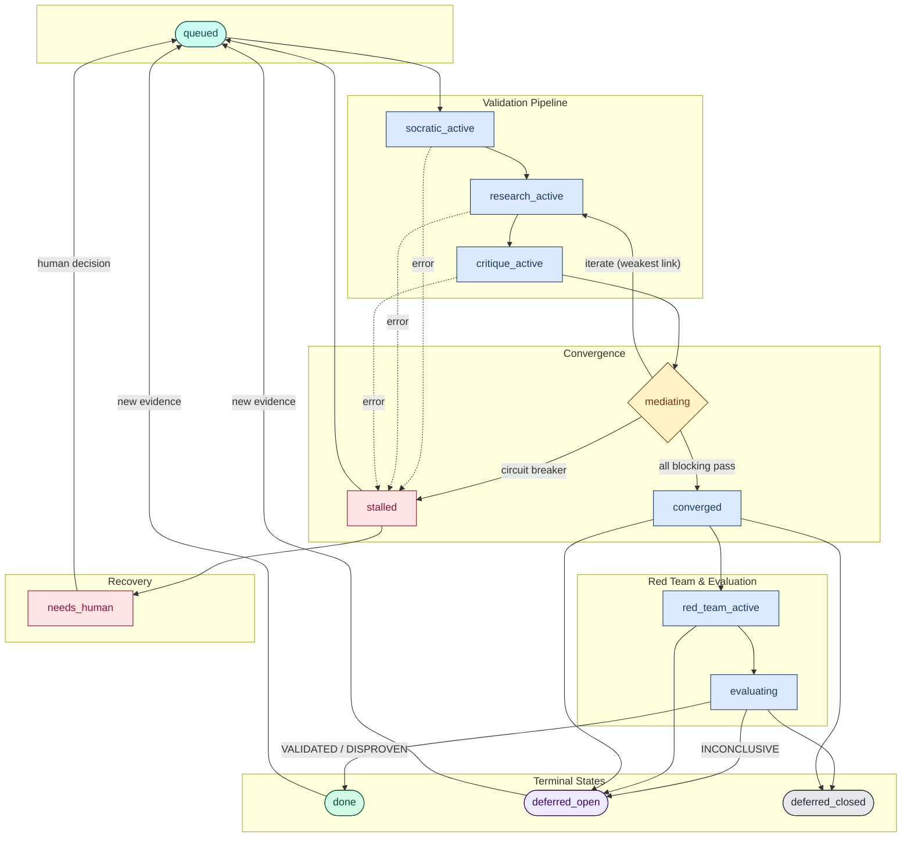

# Architecture

Petri is a colony-based research orchestration framework. It decomposes claims into directed acyclic graphs (DAGs) of logical units and validates them bottom-up through a multi-agent adversarial review pipeline.

## Colony DAG

A **colony** is a DAG of **cells**, each representing a sub-claim derived from a root claim. The hierarchy is **petri dish → colony(s) → cell(s)**. Cells are identified by composite keys: `{dish}-{colony}-{level}-{seq}`.

- **Level 0** is the center (root claim)
- Levels increase outward as claims decompose into more fundamental sub-claims
- **Leaf cells** (with no dependencies) are validated first
- Parent cells unlock for validation only after all their dependencies pass

Cycle detection (Kahn's algorithm) ensures the graph remains a valid DAG. Cross-colony edges are supported for shared dependencies.

## Agent System

Petri uses 13 agents organized into leads and specialists:

### Leads (non-blocking orchestrators)

| Agent | Role |
|-------|------|
| `decomposition_lead` | Manages claim decomposition into DAG |
| `cell_lead` | Orchestrates cell through validation phases |
| `red_team_lead` | Leads adversarial disproval attempt |

### Specialists

| Agent | Phase | Blocking | Pass Verdicts | Block Verdicts |
|-------|-------|----------|---------------|----------------|
| `investigator` | Research | Yes | EVIDENCE_SUFFICIENT, EVIDENCE_CONTRADICTS | NEEDS_MORE_EVIDENCE, CANNOT_DETERMINE |
| `freshness_checker` | Research | Yes | EVIDENCE_CURRENT, STALE_BUT_HOLDS | MATERIALLY_STALE |
| `dependency_auditor` | Research | Yes | DEPENDENCIES_CLEAN | UNVALIDATED_DEPS, CIRCULAR_REASONING |
| `skeptic` | Critique | Yes | ARGUMENT_WITHSTANDS_CRITIQUE | CRITICAL_FLAW_FOUND, UNADDRESSED_COUNTERARGUMENT |
| `champion` | Critique | Yes | STRONG_CASE, DEFENSIBLE_WITH_CAVEATS | CANNOT_DEFEND |
| `pragmatist` | Critique | Yes | PRODUCTION_READY, DIRECTIONALLY_CORRECT | WOULD_NOT_SHIP_THIS |
| `simplifier` | Critique | No | APPROPRIATELY_SCOPED, COULD_BE_SIMPLER | OVERCOMPLICATED |
| `triage` | Critique | Conditional | HIGH_VALUE, MODERATE_VALUE | LOW_VALUE_DEFER (redirects to DEFER_OPEN) |
| `impact_assessor` | Critique | No | CRITICAL_PATH, SUPPORTING_NOT_BLOCKING, ISOLATED_LOW_IMPACT | -- |
| `evidence_evaluator` | Evaluation | No | EVIDENCE_CONFIRMS, EVIDENCE_REFUTES, EVIDENCE_INCONCLUSIVE | -- |

**6 blocking agents** must all pass for convergence. The `triage` agent is conditionally blocking -- a LOW_VALUE_DEFER verdict short-circuits the cell to deferred status. Advisory agents (`simplifier`, `impact_assessor`) inform but do not gate.

## Pipeline Flow

Each cell passes through six phases:

```
1. Socratic Questioning
   Clarify terms, challenge assumptions, identify evidence needs

2. Research (3 agents, parallel)
   investigator + freshness_checker + dependency_auditor

3. Critique (6 agents, parallel) + 4 Structured Debates
   skeptic, champion, pragmatist, simplifier, triage, impact_assessor

4. Convergence Check
   All 6 blocking verdicts must pass (mechanical, no LLM)
   Fail → iterate with weakest-link feedback (max 3 iterations)

5. Red Team
   Dedicated adversarial phase builds strongest case against the cell

6. Evidence Evaluation
   Final verdict: VALIDATED, DISPROVEN, or DEFER
   Terminal verdicts require Level 1-4 sources
```

Within each phase, agents run concurrently (ThreadPoolExecutor, default 4 workers). Phases execute sequentially per cell.

## State Machine

Cells move through 14 queue states. The `mediating` state is the convergence decision point -- it either advances to red team, iterates back to research with feedback, or triggers the circuit breaker.



**Resumable states:** queued, socratic_active, research_active, critique_active, mediating

## Debate System

After critique, four structured debates sharpen the analysis:

| Pairing | Rounds | Purpose |
|---------|--------|---------|
| skeptic vs champion | 1.5 | Adversarial challenge -- can the claim survive its strongest critic? |
| skeptic vs pragmatist | 1.0 | Practical relevance -- does the critique matter in practice? |
| simplifier vs impact_assessor | 1.0 | Scope safety -- is simplification safe given the cell's impact? |
| triage vs impact_assessor | 1.0 | Effort alignment -- is the effort justified by criticality? |

A 1.5-round debate: Agent A opens, Agent B responds, Agent A rebuts. A 1.0-round debate omits the rebuttal.

## Convergence Engine

Convergence is a mechanical check (no LLM involvement):

1. Load the latest verdict per agent from the event log
2. Check each blocking agent's verdict against its `verdicts_pass` set
3. **All pass** → converged, advance to red team
4. **Any fail** → identify the **weakest link** (first failing blocking agent), generate a focused directive, iterate back to research
5. **Short-circuit** → if triage issues LOW_VALUE_DEFER with a `redirect_on_block`, skip directly to deferred status
6. **Circuit breaker** → after 3 iterations without convergence, run a decomposition audit and transition to stalled/needs_human

## Event Sourcing

Every action is recorded as an immutable event in per-cell JSONL files (`.petri/petri-dishes/{colony}/{cell}/events.jsonl`).

**11 event types:** search_executed, source_reviewed, freshness_checked, verdict_issued, evidence_appended, debate_mediated, convergence_checked, cell_reopened, propagation_triggered, decomposition_created, decomposition_audit

Events are identified by `{cell_key}-{8hex}` and timestamped in UTC. The event log is the source of truth -- the queue and metadata files are derived state.

## Citation-First Evidence Model

All agent output follows a citation-first pattern: every claim must be backed by at least one URL-linked source. Agents produce numbered sources with hierarchy levels and 1-2 sentence findings rather than verbose free-text analysis. Summaries are capped at 1-3 sentences to prevent context rot as evidence accumulates across iterations.

Evidence files (`evidence.md`) follow this structure per phase:

```markdown
### Iteration 1 — Phase 1 Research

**Source 1 (Level 2 — Authoritative Documentation):** Title (Year) — URL — Finding. **Supports claim.**
**Source 2 (Level 2 — Peer-Reviewed):** Title (Year) — URL — Finding. **Supports claim.**

**Summary:** Terse assessment with source counts and dimensions.
```

## Source Hierarchy

Evidence is ranked by a six-level credibility hierarchy:

| Level | Type |
|-------|------|
| 1 | Direct Measurement |
| 2 | Authoritative Documentation |
| 3 | Derived Calculation |
| 4 | Corroborated Expert Consensus |
| 5 | Single Expert Opinion |
| 6 | Community Report |

Terminal verdicts (VALIDATED, DISPROVEN) require at least one source at Level 4 or higher. Cells with only Level 5-6 evidence cannot reach terminal status.

## Storage

Petri uses a two-store separation:

- **Event logs** (JSONL, append-only) -- immutable audit trail per cell
- **Queue** (JSON, file-locked with `fcntl`) -- mutable state machine, atomic transitions
- **SQLite** (disposable) -- dashboard index, rebuilt from event logs on demand

No data is duplicated between event logs and queue. The event log is authoritative; the queue tracks processing state only.

## Propagation

When new evidence arrives (`petri feed`):

1. Affected cells are **re-opened** (status reset to NEW, preserving all prior evidence)
2. Dependents are **flagged** via BFS upward through the DAG
3. Flagged dependents are not automatically re-opened (conservative approach -- requires explicit re-queueing)
4. `cell_reopened` and `propagation_triggered` events are logged for audit
