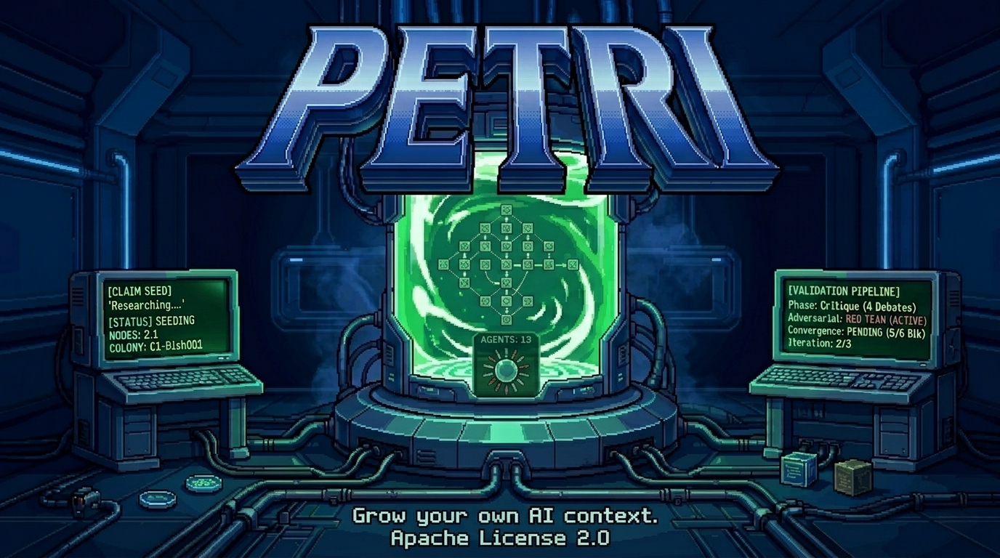

# Petri

An agent orchestration framework to grow your AI's context. Decomposes claims into DAGs of logical units and validates them bottom-up through a 13-agent adversarial review pipeline.

## Cost Warning

Petri's multi-agent pipeline can be **expensive with paid LLM models**. Each node goes through 13 agents across multiple iterations, generating significant token usage.

**By default, Petri uses `gemma4:4b` — a free, local model** that requires no API keys or billing. This protects you from unexpected costs while you explore the framework.

All inference routes through [Claude Code](https://claude.com/claude-code), which handles model routing automatically — local models via Ollama, cloud models via the Anthropic API. Switching models is **opt-in** via `petri.yaml` or the setup wizard:

```yaml
model:
  name: claude-sonnet-4-6
```

Understand the cost implications before switching to cloud models: a single colony with 10+ nodes can generate thousands of LLM calls across Socratic analysis, research, critique, debate, red team, and evaluation phases.

## Prerequisites

1. **[Claude Code](https://claude.com/claude-code)** — Petri uses Claude Code as its inference harness.
2. **[Ollama](https://ollama.com)** — Required for local models. Claude Code connects to Ollama automatically ([setup guide](https://docs.ollama.com/integrations/claude-code)).

```bash
# Install Ollama and pull the default model
ollama pull gemma4:4b
```

## Install

```bash
uv pip install petri-grow
```

This installs the CLI and core library. No API keys required for local models.

Fallback (pip):

```bash
pip install petri-grow
```

## Quickstart

```bash
# 1. Initialize
mkdir my-research && cd my-research
petri init

# 2. Seed a colony from a claim
petri seed "A hotdog is a sandwich"

# 3. Check status
petri check

# 4. Grow nodes through the validation pipeline
petri grow --all

# 5. Feed new evidence
petri feed https://arxiv.org/abs/2026.12345

# 6. Analyze
petri analyze --graph       # text tree / DOT export
petri analyze --dashboard   # REST + SSE API on port 8090
petri analyze --scan --fix  # contradiction scanner

# 7. Stop
petri stop
```

See [specs/001-petri/quickstart.md](specs/001-petri/quickstart.md) for the full walkthrough.

## CLI Reference

```
petri --help
```

| Command | Description | Key Flags |
|---------|-------------|-----------|
| `petri init` | Create `.petri/` directory with defaults | `--name` |
| `petri seed <claim>` | Decompose a claim into a colony DAG | `--no-questions`, `--colony` |
| `petri check` | Show node statuses across colonies | `--colony`, `--node`, `--json` |
| `petri grow` | Run nodes through the validation pipeline | `--all`, `--colony`, `--dry-run`, `--max-concurrent` |
| `petri feed <source>` | Ingest new evidence and flag affected nodes | `--colony`, `--auto-reopen` |
| `petri analyze` | Visualization and diagnostics | `--graph`, `--dashboard`, `--scan`, `--fix` |
| `petri stop` | Gracefully halt active processing | `--force` |

**Typical workflow:**

1. `petri init` -- one-time setup
2. `petri seed "your claim"` -- decompose into a colony
3. `petri grow --all` -- validate bottom-up (cells first, then parents)
4. `petri check` -- inspect progress
5. `petri feed <url>` -- add evidence, re-open affected nodes
6. `petri grow --all` -- re-validate impacted nodes
7. `petri analyze --graph` -- view the final colony structure

> **Note:** `petri grow --all` processes all currently eligible nodes. For multi-level colonies, run it multiple times until all levels are resolved — cells validate first, unlocking their parents.

## How It Works

Each node in the colony goes through:

1. **Research phase** -- Investigator gathers evidence, Freshness Checker verifies currency
2. **Critique phase** -- 6 specialist agents assess in parallel, Node Lead mediates 4 structured debates
3. **Convergence check** -- All 6 blocking verdicts must pass (mechanical check, no LLM)
4. **Circuit breaker** -- Max 3 iterations per cycle; if not converged, flags for human guidance
5. **Red Team** -- Dedicated adversarial phase builds the strongest case against the node
6. **Evidence Evaluation** -- Neutral weighing of all evidence: VALIDATED, DISPROVEN, or DEFER

Every action is logged as an immutable event in the node's JSONL file, identified by a composite key (`{dish}-{colony}-{level}-{seq}-{8hex}`).

## Architecture

- **13 agents**: 3 lead orchestrators + 10 specialists (6 blocking, 4 advisory)
- **Event sourcing**: append-only JSONL per node, rolled up to SQLite for the dashboard
- **Queue state machine**: 13 states with enforced transitions, file-locked for concurrency
- **Harness-agnostic**: core uses only stdlib + Pydantic; adapters bridge to Claude Code and future harnesses

## Development

```bash
uv pip install -e ".[all]"
uv run pytest tests/
```

## License

MIT
