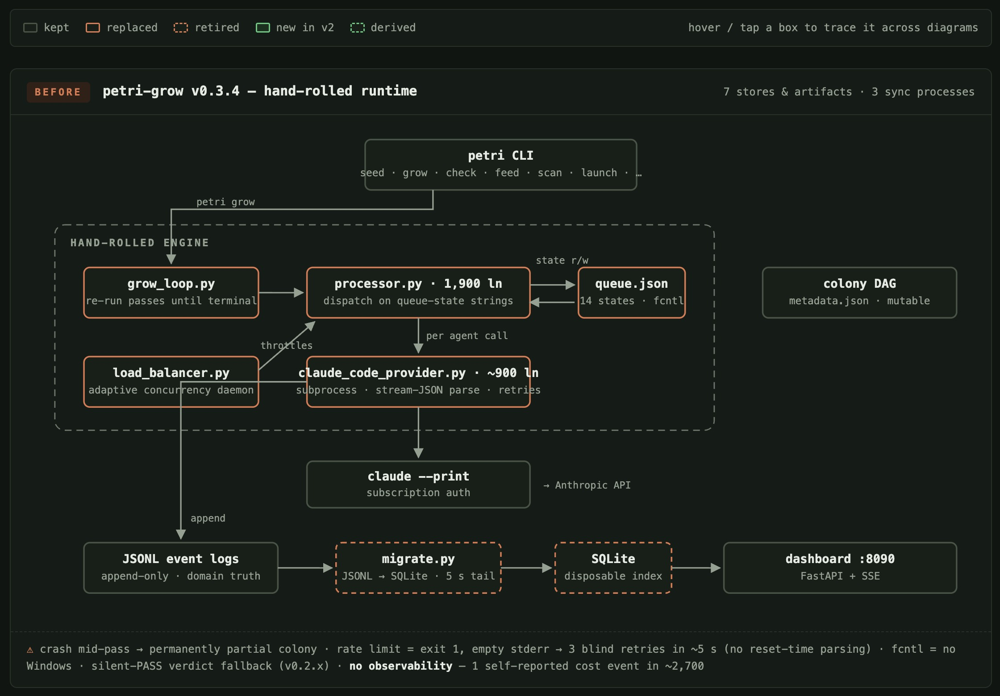

# Petri v2 Architecture

> The decision record and target architecture for the Petri v2 migration. This document is the
> single reference that migration issues cite — read it once and every issue's "why" is covered.
> The milestone roadmap and issue backlog live in
> [docs/v2/MIGRATION_PLAN.md](v2/MIGRATION_PLAN.md); the real-world evidence behind these
> decisions is indexed in [docs/field-reports.md](field-reports.md) (issues cite its entries as
> `#N` field-report numbers in code spans).

## Before / after at a glance

**Before** — `petri-grow` v0.3.4, the hand-rolled runtime (a 14-state fcntl-locked queue, an
adaptive load balancer, a subprocess stream parser, and a JSONL-plus-SQLite read path):

**After** — Petri v2, typed agents on a durable substrate (a typed pydantic-graph pipeline run as
durable DBOS workflows behind a swappable seam, one `petri.sqlite` per dish, OpenTelemetry
throughout):

## 1. The decision record (D1–D10)

Settled 2026-07-12 by the maintainer; issues must not re-litigate these.

| # | Decision | Key constraint |
|---|----------|----------------|
| D1 | Incremental strangler — CLI surface and `.petri/` layout stay; internals replaced subsystem-by-subsystem, shipping at every step | **Never require Docker or Postgres.** DBOS behind a swappable seam + Phase-0 spike |
| D2 | Durability: crash/interrupt resume, rate-limit-aware queueing, exactly-once LLM step recording, workflow observability | **OpenTelemetry is a first-class migration goal**, not an add-on |
| D3 | Inference: first-party pydantic-ai `Model` subclasses + any provider string in `petri.yaml` | Zero-API-key subscription auth stays possible |
| D4Δ | Storage (amended): one Petri-owned `petri.sqlite` per dish = domain truth (append-only `events` + `cells`/`edges` + `spans`/`usage` + views, stdlib sqlite3); DBOS SQLite = execution state only (separate file); `petri export` emits derived text for git/PR review | Events never edited or deleted — now schema-enforced; DuckDB dropped; `dashboard/migrate.py` and the combined-log rollup retire |
| D5 | Harness layer with **pi as default** (`--mode rpc`), Claude Code kept as adapter | pi is an optional runtime dependency, never a pip dependency |
| D6 | Agentic decomposer (search_cells tool, typed outputs, bedrock stop, counterarguments, per-parent caps) + `pydantic_evals` regression suite | Verdict-driven re-decomposition (#9) is a follow-on (M7) |
| D7 | OTLP export + trace view in the `petri launch` dashboard backed by the local `spans` table | Zero-infra default; DBOS Conductor/Console (proprietary) never bundled |
| D8 | No backward compatibility — v2 starts fresh | Old dishes stay on disk; reads tolerate their presence |
| D9 | Agent structure (enums, blocking semantics, debate protocol, pipeline) in typed code; content (instructions, vocabularies, pairings, models) in `petri.yaml` | "Configured, not hardcoded" survives with type safety |
| D10 | Milestones + small independently-landable issues + tracking epics + in-repo ARCHITECTURE-V2 doc | Label semantics defined once, in the doc |

## 2. What v2 preserves exactly (identity invariants)

- **Mechanical convergence** — all 6 blocking specialists' latest verdicts in their pass sets; a
  boolean check, no LLM judge — including weakest-link directives, short-circuits, and the
  3-iteration circuit breaker.
- **Append-only domain event sourcing** as the audit trail (the blog part-1 thesis) — now a
  schema-enforced `events` table (D4Δ), exportable as diffable text via `petri export`.
- **Composite cell keys** `{dish}-{colony}-{level}-{seq}` — which now double as deterministic DBOS
  workflow IDs, giving exactly-once cell processing for free.
- **Two-store separation** — domain truth (`petri.sqlite`) vs execution state (was `queue.json`,
  becomes the DBOS system DB in its own file); nothing crosses the boundary.
- **The 13-agent roster** (3 non-blocking leads + 10 specialists, 6 blocking) and the 4 debate
  pairings. (The shipped `petri.yaml` has a 14th entry, `socratic_questioner` — disposition is
  settled: it becomes a pre-pipeline utility outside the roster enum.)
- **The colony DAG as runtime data** (`graph/colony.py` — cycle detection, Kahn validation, BFS
  levels, bottom-up eligibility). pydantic-graph models only the fixed per-cell pipeline shape.
- **The constitution** as governance, with leads re-reading it per iteration (the documented
  drift-prevention pattern).
- **The CLI surface** (all 11 commands) and zero-infrastructure single-machine operation.
- **The micro-orchestrator identity**: v2 adopts substrate (typed model calls, checkpointed
  execution), not someone else's workflow abstraction. The workflow remains Petri's own.

## 3. Target architecture

### New packages

| Package | Purpose |
|---|---|
| `petri/harness/` | Harness abstraction (D5): pydantic-ai `Model` subclasses speaking CLI/RPC protocols — `PiModel` (default, `--mode rpc`), `ClaudeCodeModel`, provider-string passthrough; typed error taxonomy (`RateLimitedError.retry_after_seconds`, `AuthExpiredError`), shared retry policy (disable-able to avoid double-retry under DBOS) |
| `petri/execution/` | The durability seam (D1): a thin `ExecutionBackend` interface over DBOS-on-SQLite — durable workflows/steps, queues (concurrency, limiter), cancellation, fork, recovery. Swappable if the spike fails |
| `petri/pipeline/` | The per-cell validation pipeline as pydantic-graph typed nodes (Socratic → Research → Critique/Debates → Convergence → RedTeam → Evaluate), replacing the 14-state queue machine |
| `petri/agents/` | The agent factory (D9): builds 13 pydantic-ai Agents from typed structure + YAML content; debates as message-history hand-offs with shared usage + `UsageLimits`; eager config validation at startup |
| `petri/observability/` | OTel throughout (D2/D7): OTLP export + local `spans`/`usage` tables in petri.sqlite (age-pruned); domain attributes (dish/colony/cell, agent role, verdict, tokens/cost) |
| `petri/query/` | The read path (D4Δ): SQL views + typed query functions over petri.sqlite — convergence reads, validator reads, dashboard, analytics. Stdlib sqlite3; no DuckDB |
| `petri/evals/` | `pydantic_evals` decomposition-quality suite (D6): quota detection, bedrock stops, counterargument presence, restatement-children detection, cross-colony edge precision/recall |

### Module fates (current → v2)

| Current module | Fate | Target / rationale |
|---|---|---|
| `models.py` | Rewritten | Domain half (Cell, Event, typed payloads, composite keys) ports; `QueueState`/`QueueEntry` retire with the queue; `is_atomic` + `bedrock_reason` + typed claim-relation added to cells |
| `config.py` | Rewritten | Validated config object passed explicitly; import-time constants, `lru_cache` loader, and silent packaged-default fallback all retire (root cause of field issue #2) |
| `cli/*`, `cli_ui.py` | Kept | Same Typer commands — the strangler seam; internals rewired to the new engine |
| `engine/processor.py` | Replaced | → `petri/pipeline/` (pydantic-graph nodes) executed under `petri/execution/` |
| `engine/grow_loop.py` | Replaced | → DBOS queue draining + a colony orchestrator workflow that loops levels until no eligible cells remain (single-command full-colony growth) |
| `engine/propagation.py` | Wrapped | Pure DFS logic kept; flag-don't-auto-requeue human gate preserved |
| `engine/load_balancer.py` | Replaced | → DBOS queue flow control (`worker_concurrency`, `limiter`) |
| `engine/preflight.py` | Kept | Extended: pi/Node detection, version-range check |
| `storage/event_log.py` | Rewritten | Remains the single write seam, now writing rows to the `events` table (append-only, UNIQUE deterministic IDs — idempotent by constraint); `rollup_to_combined` retires |
| `storage/queue.py` | Replaced | → DBOS system DB + pipeline graph. The fcntl lock, `VALID_TRANSITIONS`, and the Windows blocker all retire |
| `storage/paths.py` | Rewritten | Shrinks dramatically under D4Δ: the tree becomes `petri-dishes/<dish_id>/petri.sqlite` + `exports/` (#14); lossy `parse_cell_id` consolidated away |
| `analysis/convergence.py` | Kept | Pure functions, ported verbatim onto typed verdicts — identity feature |
| `analysis/validators.py` | Rewritten | Same source-hierarchy rules as pure policy + `@output_validator` (ModelRetry) |
| `analysis/scanner.py` | Rewritten (M7) | Most drift categories disappear when structure is typed; shrinks to config validation + event-log integrity |
| `reasoning/decomposer.py` | Rewritten | → agentic decomposer (M3): search_cells, typed results, bedrock stop, per-parent caps in code |
| `reasoning/debate.py` | Rewritten | v1 "debates" are format-only stubs; v2 runs real multi-turn exchanges (M2) |
| `reasoning/ingest.py` | Wrapped | Kept; network I/O becomes DBOS steps; failure sentinels become typed errors (M7) |
| `reasoning/claude_code_provider.py` | Replaced | → `petri/harness/` Model subclasses; prompt builders extracted first (M1) |
| `graph/colony.py` | Kept | Runtime-data DAG (in-memory ops unchanged); persistence moves to the `cells`/`edges` tables, `dependents` becomes a view; gains integrity hardening in M6 |
| `dashboard/api.py` | Rewritten | FastAPI+SSE shell kept; reads → petri.sqlite via `petri/query/`; `/api/queue` → ExecutionBackend; `/api/proc` PTY bridge → workflow start/cancel/status |
| `dashboard/migrate.py` | Retired | The dashboard reads the domain store directly — no index rebuild |
| `dashboard/frontend.py` + `templates/frontend.html` | Kept | Field-hardened UI; gains the trace waterfall (M5) |
| `adapters/*` | Replaced | → `petri/harness/` backends; the generated-markdown-config approach retires |
| `templates/*.txt` | Retired | Prompt content moves to YAML instructions + typed agents |
| `defaults/` (petri.yaml, constitution.md) | Kept | The user-facing contract; schema updated to the D9 split |

## 4. Label semantics

Labels on migration issues carry defined meanings:

- **`breaking-change`** — the change observably alters behavior for existing users (CLI output,
  file formats, defaults). Absence means existing dishes and workflows behave identically.
- **`spike`** — a timeboxed investigation. The deliverable is a written document
  (`docs/spikes/...`) with go/no-go findings, not production code.
- **`rfc`** — design-first: the issue expects discussion and a written proposal before
  implementation starts.
- **`good first issue`** — newcomer-safe: self-contained, requires no context beyond the linked
  docs, and does not touch convergence semantics, the harness RPC protocol, or DBOS internals.
- **`size:S` / `size:M` / `size:L`** — rough effort estimate (hours / a day or two / several days).
- **Area labels** (`harness`, `agents`, `decomposer`, `durable-execution`, `observability`,
  `storage`, `dashboard`, `lifecycle`) — the subsystem the issue touches.
- **`epic`** — a milestone tracking issue; its sub-issues are the milestone's work.
- **`migration-v2`** — every issue in this migration backlog.

## 5. ADR index

Architecture Decision Records append here as the migration makes further decisions.

| ADR | Title | Status |
|-----|-------|--------|
| ADR-0001 | Storage: single Petri-owned `petri.sqlite` per dish (the D4 amendment) — replaces the earlier JSONL-files-plus-DuckDB read-layer design; text becomes a derived `petri export` artifact | Accepted — full write-up pending (tracked by the M1 "Finalize docs/ARCHITECTURE-V2.md" issue) |
